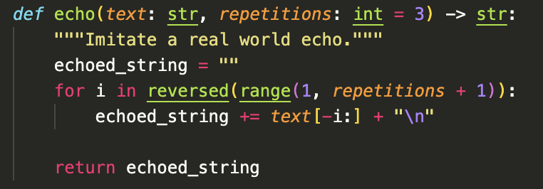
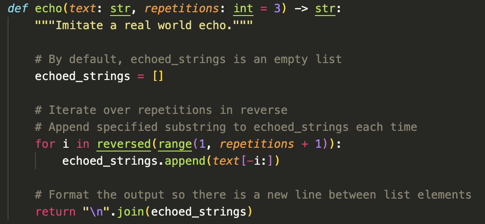
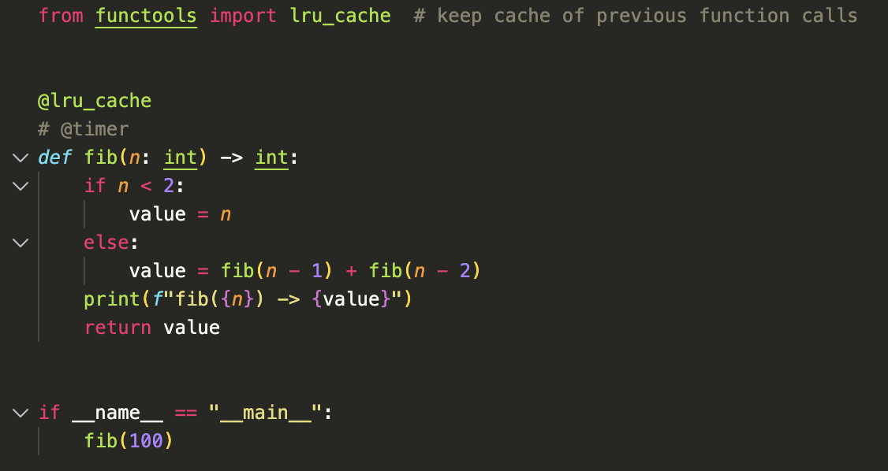
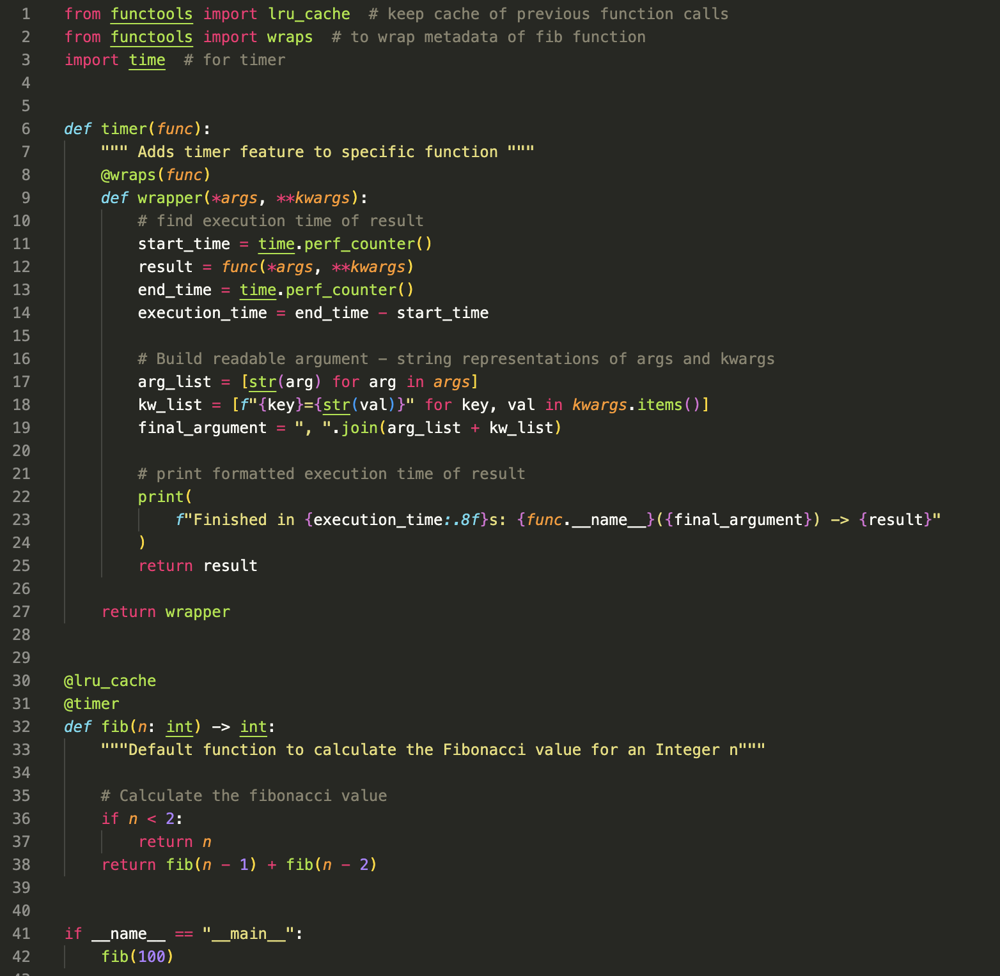
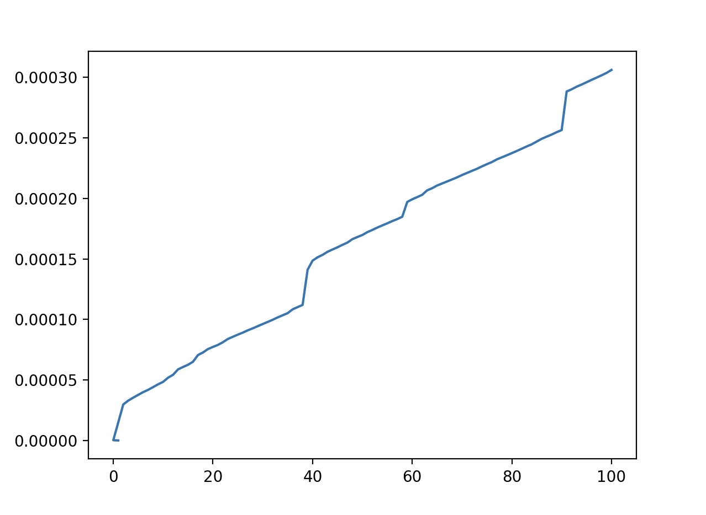

# Web Development in Python

# HW 1: Python Refresher

## Basic Setup

Clone the repository in VSCode and open in a local folder on your machine.

Then, activate a virtual environment using your terminal. Note that if you're using your computer's terminal, you have to be within the correct directory for this project. Alternatively, you can use the built-in terminal on VSCode.

```bash
$ python -m venv venv
$ source venv/bin/activate
```

The .gitignore file will ensure that this venv is not pushed to the remote repository.

To install all necessary packages/modules for this repository, run the following terminal command:

```
$ pip install -r requirements.txt
```

Next, create a Python file 'echo.py' with the following code:

```
def echo(text: str, repetitions: int = 3) -> str:
    """Imitate a real world echo."""
    pass


if __name__ == "__main__":
    text = input("Yell something at a mountain\n")
    # note: newline character added by me for formatting purposes

    print(echo(text))
```

Now create a Python file 'fib.py' with the following code. @lru_cache is a decorator in the functools package, so it's important to ensure that they are imported into your file.

```
from functools import lru_cache # added by me

@lru_cache # keep cache of previous function calls
@timer # to be implemented
def fib(n: int) -> int:
    ...

if __name__ == "__main__":
    fib(100)
```

**_IMPORTANT_**

To run each file in the venv, use the following terminal commands:

For echo.py:

```
$ python echo.py
```

For fib.py:

```
$ python fib.py
```

## My Work

### Part 1: Python Programming Basics: The Echo Function

Below is the initial function that I wrote. I iterated over the **repetitions** variable in reverse, adding a substring of the text variable every time using slicing. I skipped over the value i = 0, as a string sliced with [-0:] would just return that string.

I also put the maximum range argument as **repetitions + 1**, as the specified stop parameter within the range function is not included in the range's count. I wanted to include the value of the repetitions variable, so I had to stop my range at repetitions + 1.


However, I quickly remembered that the range function has parameters that can control both the beginning and end of one's chosen range. I therefore got rid of my if statement and changed my **range() arguments** accordingly:



**The Output:**

```
Yell something at a mountain
hello there
ere
re
e

```

There was just one problem left - the way my function was written, it was returning an **empty line** after my output was printed. I did some research, and to fix this issue, I turned the echoed_string variable into a **list**, appending to the list during each iteration of the for loop. Then, I used the **join function** to place a newline character in between each element of the list. This effectively produced the correctly formatted output.



**The Output:**

```
Yell something at a mountain
hello there
ere
re
e
```

### Part 2: Python Decorator Implementation: The Fibonacci Sequence

First, I implemented a recursive function that completed the Fibonacci sequence **without** the @timer decorator:



The output was as follows:

```
fib(1) -> 1
fib(0) -> 0
fib(2) -> 1
fib(3) -> 2
fib(4) -> 3
fib(5) -> 5
... # omitted for simplicity
fib(98) -> 135301852344706746049
fib(99) -> 218922995834555169026
fib(100) -> 354224848179261915075
```

Next, I implemented the timer decorator. I created a **wrapper functio**n to find the execution time, and then I printed a **formatted string**.

Note that I removed the print call from the fib() function and placed it into the wrapper function. To keep the formatting of the Fibonacci result (i.e., f(1) -> 1) the same, I did some research and strategically unwrapped both \*args and \*\*kwargs for a full list of all arguments. This allowed me to put the execution time and desired Fibonacci information into the same formatted string.



The output was as follows:

```
Finished in 0.00000021s: fib(1) -> 1
Finished in 0.00000042s: fib(0) -> 0
Finished in 0.00002992s: fib(2) -> 1
Finished in 0.00003308s: fib(3) -> 2
Finished in 0.00003550s: fib(4) -> 3
Finished in 0.00003783s: fib(5) -> 5
... # omitted for simplicity
Finished in 0.00030146s: fib(98) -> 135301852344706746049
Finished in 0.00030350s: fib(99) -> 218922995834555169026
Finished in 0.00030596s: fib(100) -> 354224848179261915075
```

Note that the execution times naturally change each time the function is run. This is because the function may have slightly different load times for each execution.

Here is the timing for the above output, plotted into a graph:



The reason the runtime is increasing as n increases is because a higher value of n requires more recursive calls. Therefore, an n of 100 inherently requires more runtime compared to an n of 4. An n with a value of 2 or less involves even less runtime, as no recursion is required.

My final code that includes the matplotlib graph is viewable in fib.py.
